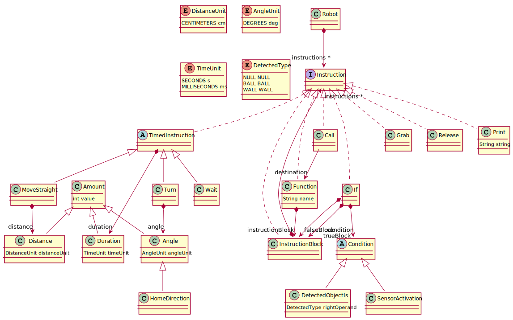

# Projet Interprétation Des Langages robot Vrep
## Installation et utilisation
### Installation
- Ouvrir Le dossier `Project` en tant que workspace avec eclipse
- Cliquer sur File -> Import -> Existing Projects; sélectionner le dossier `Project`
- Répéter la même opération mais importer les projets du dossier PolyBot
- Attendre que les projets build
### Pour lancer l'exemple
- Lancer la configuration eclipse `Linux_Workbench` qui se trouve dans le dossier `launch_configurations` du projet `fr.unice.polytech.robotproject.dsl`
- Dans le nouvel eclipse importer le projet `test` qui est dans `runtime-New_configuration`
- Lancer V-REP et importer le fichier `PolyBot\scenes\polyBotVersusPaintBomb.ttt`
- Dans le nouvel eclipse lancez la configuration qui est dans `test/launch_configurations`
## Model

J'ai choisi que mon langage allait être impératif.
Donc dans le langage les instructions héritent de la classe Instruction.
Étant donné qu'un programme dans le langage doit être synchronisé avec la simulation
J'ai choisi d'avoir des TimedInstructions qui permettent de faire avancer la simulation et sont bloquantes pendant le temps spécifié.
Pour exprimer le temps et les distances des mouvements j'ai choisi d'avoir des Énumérations qui permettent de donner des unités à ces valeurs.
Ce qui fait que pour exprimer un mouvement on va spécifier la distance son unité puis en combien de temps on souhaite bouger avec l'unité temporelle.
J'ai aussi choisi d'implémenter des opérateurs conditionnels avec `if` et `else` qui évaluent une condition.
Les conditions disponibles sont de deux types:
 - Une simple qui est vraie si le robot detecte quelque chose
 - Une qui permet de vérifier le type de l'objet détecté selon l'énumération `DetectedType`

J'ai également choisi d'implémenter des fonctions qui sont plus des procédures sans arguments qui sont appelées grâce à l'objet `call`.
Ces permettent de faire des boucles grâce à la récursivité.

Plutot que cette manière impérative, j'aurais préféré mettre en place un système réactif.
En se basant sur mon modèle actuel on pourrait penser rajouter une classe `When` qui contiendrait une condition et qui aurait aussi une référence vers une fonction. Il faudrait aussi ensuite qu'à chaque étape de la simulation les `When` déclarés soit parcourus et leur condition évaluées ce qui permettrait de lancer la fonction référencée.
## Auteur
*Canava Thomas*